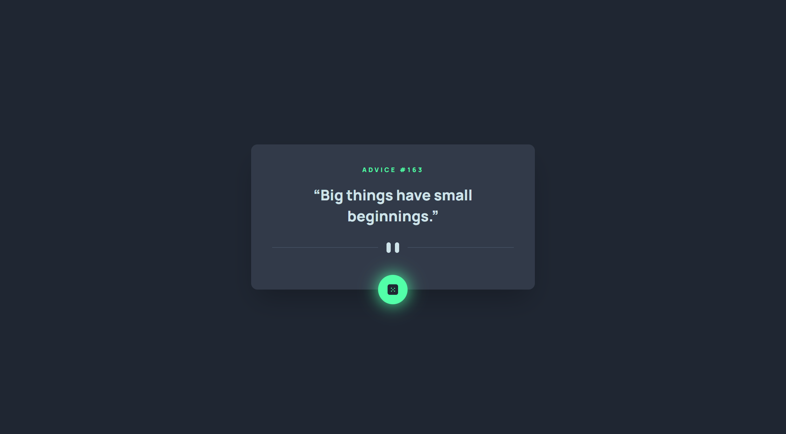

# Frontend Mentor - Advice generator app solution

This is a solution to the [Advice generator app challenge on Frontend Mentor](https://www.frontendmentor.io/challenges/advice-generator-app-QdUG-13db). Frontend Mentor challenges help you improve your coding skills by building realistic projects.

## Table of contents

- [Overview](#overview)
  - [The challenge](#the-challenge)
  - [Screenshot](#screenshot)
  - [Links](#links)
- [My process](#my-process)
  - [Built with](#built-with)
  - [What I learned](#what-i-learned)
- [Author](#author)

## Overview

### The challenge

Users should be able to:

- View the optimal layout for the app depending on their device's screen size
- See hover states for all interactive elements on the page
- Generate a new piece of advice by clicking the dice icon

### Screenshot



### Links

- Solution URL: [Frontend Mentor](https://www.frontendmentor.io/solutions/advice-generator-app-with-react-typescript-tailwindcss-AAocz9QUmF)
- Live Site URL: [GitHub Pages](https://luzefiru.github.io/advice-generator-app/)

## My process

### Built with

- Semantic HTML5 markup
- React
- TypeScript
- TailwindCSS
- a11y
- Mobile-first workflow
- React Testing Library + `jest-dom`

### What I learned

I learned that components would naturally be slightly off-center when we make them `position: absolute` while their parents are `position: relative`.

In order to combat this, I realized that all I needed to do was add a `transform: translate(50%, 50%)` according to how I aligned it in order to position itself relative to its own size.

```jsx
<div className="relative">
  <button className="RandomizeButton absolute bottom-0 -translate-x-1/2 translate-y-1/2 left-1/2" />
</div>
```

I also learned that I no longer need to do:

```css
html {
  height: 100%;
}

body {
  min-height: 100%;
}
```

I can instead simply do:

```css
body {
  height: 100vh;
}
```

Thanks to this resource [HTML vs Body: How to Set Width and Height for Full Page Size](https://www.freecodecamp.org/news/html-page-width-height/).

## Author

- Website - [Luzefiru](https://luzefiru.github.io/Portfolio/)
- Frontend Mentor - [@Luzefiru](https://www.frontendmentor.io/profile/Luzefiru)
